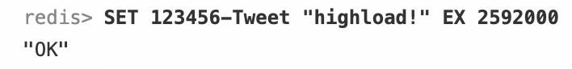

# Ivan Zakharov - Twitter architecture design

## 1. Обзор темы

### 1.1 Twitter

Твиттер — это социальная сеть для публичного обмена сообщениями, которая была запущена в 2006 году компанией "Twitter, Inc.". На данный момент Твиттер насчитывает более [5000 сотрудников](https://en.wikipedia.org/wiki/Twitter). 
Пользователи сервиса — люди любого возраста, имеющие доступ в сеть Интернет, однако преобладающей часть аудитории являются [мужчины 25-49 лет](https://www.businessofapps.com/data/twitter-statistics/). 
Использовать социальную сеть можно через веб-страницу, мобильное приложение или другие пользовательские клиент-приложения.
Бóльшая часть кодовой базы Твиттера [написана](https://www.infoq.com/articles/twitter-java-use/) на языках программирования "Java", "Ruby", "Scala", "JavaScript".
   
### 1.2 Целевая аудитория

При планировании курсовой работы было решено акцентировать внимание на ключевом функционале Твиттера — новостной ленте. 
Будем использовать следующие целевые значения:

- 300 миллионов пользователей сети;
- 500 миллионов твиттов в день;
- 190 миллионов уникальных пользователей в день;
- Географическое расположение пользователей: Северная Америка, Южная Америка, Европа.

## 2. Расчет нагрузки

### 2.1 Отправка / чтение твиттов

Каждый день новостная лента должна выдерживать большое количество запросов на чтение и запись. Исходя из запланированной нагрузки - 500 миллионов твиттов в день, допустим, что отношение запросов на чтение к запросам на запись = 1 / 1.
Таким образом, среднее значение **WriteRPS** = 500 миллионов / день ≈ 5800, **ReadRPS** = WriteRPS = 5800.

### 2.2 Пиковая нагрузка

География нашего сервиса позволяет сделать вывод, что пользователи расположены от -11 UTC timezone до +2 UTC timezone. Пользователи находятся в диапазоне 13 часов, таким образом, пиковая нагрузка относительно географии сервиса относительно равномерно распределена (исходя из предположения, что 16-ти часовая активность пользователей -11UTC будет компенсироваться активностью пользователей +1 UTC).
Пиковая нагрузка на Твиттер приходится на 13-тый час дня, количество твиттов за этот час [составляет](https://smallbusiness.chron.com/peak-times-twitter-activity-62864.html) 5.44% от дневного количества твиттов. Следовательно, пиковая нагрузка составляет 500 миллионов / день * 0.0544 / 3600 с ≈ 7 555 WriteRPS = 75 550 ReadRPS.
На пиковую нагрузку так же влияют [дни недели](https://neilpatel.com/blog/the-science-of-twitter-timing/), праздничные дни, [растущая аудитория сервиса](https://blog.hootsuite.com/twitter-statistics/#:~:text=Twitter's%20user%20base%20is%20predicted%20to%20grow%202.4%25%20in%202021&text=In%20October%2C%20they%20revised%20their,by%202.0%25%20growth%20in%202022.), мировые события и т.д.

Допустим, что максимальная нагрузка на сервис будет составлять троекратную среднюю нагрузку, следовательно, она будет равна WriteRPS * 3 = 17400, ReadRPS = 174 000.

## 2.3 Хранилище данных

### 2.3.1 Текстовое хранилище данных

Рассчитаем необходимое количество памяти для хранения всех твиттов пользователей в течении следующих 10 лет.
Максимальная длина твитта составляет 280 знаков, однако средняя длина твитта составляет ≈ [33 знака](https://techcrunch.com/2018/10/30/twitters-doubling-of-character-count-from-140-to-280-had-little-impact-on-length-of-tweets/#:~:text=Now%20that%20the%20limit%20is,limit%2C%20now%20it's%201%25.).
Примем во внимание, что каждый твитт имеет мета-информацию, которая занимает ≈ 60 байт.
Таким образом, **размер хранилища** будет равен (500 миллионов / день) * (3650 дней) * (33 + 60 байт) = 169725000000000 байт ≈ 170 Терабайт.

**Средний размер хранилища пользователя за 10 лет** будет составлять 170Тб / 300 миллионов ≈ 566 КБайт.
**Количество сохраняемых данных в день** 170Тб / 3650 дней ≈ 46.5 ГБайт.

### 2.3.2 Хранение изображений

В ходе собственного исследования я использовал выборку в 500 постов своей ленты в Твиттере. К 60 постам из выборки были добавлены фотографии.
Таким образом, в среднем к каждому 8 посту в Твиттере добавляется картинка, следовательно, количество постов, содержащих картинку = 0.125 * 500 миллионов / день = 62 500 000 картинок / день.
Максимальный размер картинки, которую пользователь [может загрузить](https://influencermarketinghub.com/twitter-image-size/#:~:text=The%20ideal%20image%20size%20and,re%20posting%20via%20their%20website.) в социальную сеть - 15 Мб при использовании вебсайта и 5 Мб при использовании мобильного приложения. Допустим, что средний размер фотографии в постах твиттера = 1Мб.
**Объем файлового хранилища** за 10 лет будет составлять (62.5 миллионов / день) * (3650 дней) * (1Мб) = 228125000000 Мб = 228.125 Петабайт.
Вероятно, что экономически более целесообразно создать собственный сервис для хранения изображений, аналогичный по принципу работы S3.

Количество сохраняемых данных в файловое хранилище в день 228.125 Пб / 3650 дней = 62.5 Терабайт.

## 3. Логическая схема

Поскольку частота запросов на чтение твиттов ленты крайне высока, необходимо реализовать систему, которая не будет сильно нагружаться при обычных запросах на чтение.
Мы бы могли хранить целиком всю информацию в кластерах in-memory базы данных, но следует понимать, что выигрывая по времени обращения к данным, мы проигрываем по экономическим показателем (покупка оперативной памяти, под хранение текста в нашем сервисе на ближайшие 10 лет обойдется в ≈93 миллиона рублей) и сложности разработки, даже учитывая, что персистентность данных будет соблюдаться. А так же полностью полагаться на один инструмент — может быть опрометчиво.
Поэтому для хранения копии данных мы будем использовать реляционную СУБД.
Предполагаемая схема данных в БД:

Перейдем к in-memory хранилищу. Для хранения данных мы можем использовать следующие пары ключей-значений:

UID - это уникальный идентификатор пользователя, TID - твитта, "-Tweets", "-Followers" и "-Tweet" - строки, обозначающие тип хранимых данных. Значения в квадратных скобках — идентификаторы твиттов и пользователей из дисковой базы данных. Значения ключей будут представлять собой список — структуру данных, имплементированную во многих in-memory хранилищах и строковый тип данных.

Чтобы показать ленту новостей определенного пользователя, мы обращаемся к UID-Tweets, получаем список всех ID твиттов пользователя, затем получаем по ключу TID-Tweet тексты твиттов.
Заведем еще две "кэш" сущности, которые будут уникальны для каждого пользователя: User Timeline и Home Timeline. Их использование рассмотрим на примере:

Представим, что пользователь создал новый твит. Мы должны сохранить его твит в базу данных, а так же добавить в "кэш"-сущность User Timeline идентификатор твитта.
После чего, подписанные на нас пользователи 1, 2 и 3 - получают данный твит в свою Home Timeline.

Аналогичным образом, пользователь получает все твитты от тех пользователей, на которых он подписан. А для того, чтобы отобразить их клиенту, нам достаточно проитерироваться по Home Timeline, и, возможно, отфильтровать данные.

Но что делать, если у пользователя миллионы подписчиков? Обновлять такое огромное количество листов в Redis - медленное решение.
Допустим, что популярный пользователь создал новый твитт. Аналогично обычному пользователю, мы сохраняем его новый твитт в базу данных и User Timeline. Теперь, этот твитт должен отобразить у подписчиков популярного пользователя при загрузке ленты новостей.
Для этого перед тем как отдать пользователю все новые посты, мы просмотрим на список популярных пользователей, на которых подписан данный пользователь. После чего, возьмем из User Timeline звезд те посты, которые нужны для отображения ленты, после чего добавим их в пользовательский Home Timeline.

## 4. Физическая схема

### 4.1 Схема данных и технологии

Для хранения копии данных в дисковой базе данных будем использовать Postgres.
Для хранения данных в памяти будем использовать Redis или любое другое горизонтально-масштабируемое in-memory хранилище данных (Tarantool, Aerospike и т.д.).

Физическая схема хранения данных:

#### 4.1.1 Redis
Хранить абсолютно все твитты в Redis - некорректная трата места, т.к. чаще всего наибольшим спросом обладают новейшие твитты. Таким образом, в Redis предлагается хранить твитты, опубликованные не позже последнего месяца.

Ключ EXPIRE в Redis доступен при создании ключа (однако недоступен для значений) поэтому задавать срок удаления записей у нас получится только для "таблицы" "<TID>-Tweet: str".
На примере показана возможность задать срок жизни твитта, добавленного в Redis. Значение длительности жизни исчисляется в секундах, 1 месяц ≈ 30 * 24 * 60 * 60 = 2592000 секунд.

 

### 4.2 Шардирование и репликация

В данном подходе шардирование не так важно, поскольку мы храним на дисках копии значений, так же хранящихся к in-memory хранилище. Однако, стоит учесть, что мы могли бы прибегнуть к иному варианту - сильно реплицировать дисковую базу данных, чтобы задержки на операции чтения были минимальными. Redis и Postgres поддерживают master-slave репликацию, что мы могли бы использовать при таком подходе.
Рассмотрим две стратегии шардирования данных:
 - Шардирование данных по UserID;
 - Шардирование данных по TweetID.

#### 4.2.1 Шардирование по UserID

При использовании этого подхода, возникают ряд проблем:
- Шарды, хранящие информацию популярных пользователей, будут сильно нагружены, что повысит задержки на получение информации для пользователей, чья информация так же хранится на этом шарде;
- Ряд пользователей может создавать гораздо большее кол-во информации, чем остальные. Если не балансировать шарды, содержание большое кол-во популярных пользователей, то место на этих шардах закончится, а задержки к ним будут гораздо выше обычных.

#### 4.2.2 Шардирование по TweetID
Данных подход решает проблемы неравномерной загруженности шардов, однако для получения твиттов одного пользователя, необходимо будет запросить информацию с разных шардов.

## 5. Выбор технологий

Для разработки серверной части сервиса мы будем использовать Go (Gin), для фронтенд разработки JS (React).
Для хранилищ данных выберем Redis и Postgres.
В качестве фронтенд сервера выберем Nginx.

## 6. Расчет нагрузки БД

Для грамотного выбора оборудования и экономической оценки продукта необходимо рассчитать нагрузку, приходящуюся на базы данных проекта.
Рассмотрим каждую таблицу баз данных отдельно.

### 6.1 Redis

#### 6.1.1 UID-Tweets
"Таблица" содержит идентификатор пользователя и список идентификаторов твиттов данного пользователя.

Мы имеем 190 миллионов уникальных пользователей в день, которые создают 500 миллионов твиттов, следовательно, каждый пользователь в среднем в день постит 500 / 190 = 2.63 твитта.

Нагрузка на запись в эту таблицу 500 миллионов / (24 * 60 * 60) ≈ 5800 RPS.
Нагрузка на чтение 190 000 000 * 50 / (24 * 60 * 60) ≈ 109 950 RPS.

Количество "строк" в таблице приравняем к количеству элементов списка - в день пользователь создает в среднем 3 твитта, следовательно, кол-во строк будет равно 1 900 000 * 3 = 5 700 000 записей в день.
Строк всего 5 700 000 * 3650 = 20 805 000 000 - за 10 лет.

Общий объем будет составлять 5 700 000 * длину идентификатора твитта (длину строки), примем ее в среднем равной 8 байт = 45600000 байт = 45.6 Мегабайт (за 1 день).
Объем за 10 лет = 45600000 * 3650 = 166440000000 байт ≈ 166 Гигабайт. 

#### 6.1.2 UID-Followers
"Таблица" содержит идентификатор пользователя и список идентификаторов пользователей, подписанных на данного пользователя.

Таблица не является сильно нагруженной на запись, поскольку на пользователей сети подписываются многократно реже, чем пишут твитты или загружают ленту.
Однако, таблица будет часто использоваться при составлении timeline пользователей. Для 1 900 000 уникальных пользователей твиттера в день, нагрузка на чтение таблицы составит: 1 900 000 / (24 * 60 * 60) ≈ 22 RPS. 

Количество "строк" в таблице приравняем к количеству элементов списка. Средний пользователь имеет 707 подписчиков, следовательно, кол-во строк будет равно 5 000 000 * 707 = 3535000000 записей за все время.

Общий объем будет составлять кол-во записей * 8 = 28280000000 байт ≈ 28.3 Гигабайта. В данной работе примем объем этой таблицы как неизменную величину в виду ограниченного количества пользователей сервиса.

#### 6.1.3 UID-Tweet

"Таблица" содержит идентификатор пользователя и твитт пользователя.
В таблице будут храниться твитты за последний месяц, что достигается выставлением флага EXPIRE при записи пары ключ-значение.

В день создается 500 миллионов твиттов. Средняя длина текста твитта - 33 символа (байта). Таким образом, необходимое место для хранения такой базы ≈ 33 * 500000000 * 30 = 495000000000 байт = 495 Гигабайт в месяц.
Нагрузка на запись в эту таблицу - 500 миллионов / (24 * 60 * 60) ≈ 5800 RPS.
Нагрузка на чтение при отношении R/W = 1/1 так же равна 5800 RPS.

Количество строк в таблице = 5 миллионов строк в день.

Общий объем составляет 5 000 000 * 33 = 165000000 байт в день = 165 Мегабайт в день.
Объем за 10 лет = 165000000 * 3650 = 602250000000 байт ≈ 602 Гигабайта. 

#### 6.1.4 UID-Timeline
"Таблица" содержит идентификатор пользователя и список идентификаторов твиттов, написанных данным пользователем за сессию.

Нагрузка на запись - кол-во твиттов пользователей, т.к. каждому пользователю необходимо добавить его твитт в timeline. Нагрузка на запись ≈ 5800 RPS.
Чтение происходит при "прогрузке" постов пользователей, т.е. примерно 3 раза за день для каждого пользователя, следовательно, 3 * 1 900 000 / (24 * 60 * 60) ≈ 66 RPS.

Количество строк в таблице = 3 * 1 900 000 = 5 700 000 строк в день.

Общий объем составляет 5 700 000 * 8 = 45.6 Мегабайт в день.
За 10 лет объем равен 5 700 000 * 8 * 3650 = 166440000000 байт ≈ 166 Гигабайт.

#### 6.1.5 UID-HTimeline
"Таблица" содержит идентификатор пользователя и список идентификаторов твиттов, написанных пользователями, на которых он подписан.

Таблица будет нагружена на запись. Примем, что средний пользователь в твиттере имеет [707 подписок](https://www.brandwatch.com/blog/twitter-stats-and-statistics/). Для 707 человек, каждый из которых пишет в среднем по 3 твитта в день, получаем значение нагрузки на запись в таблицу Home Timeline: 300 000 000 * 3 * 707 / (24 * 60 * 60) ≈ 7364500 RPS (sic!).
Проблему столь высоко RPS можно решить, добавив ограничение на максимальную длину очереди Home Timeline для пользователя. Обычному пользователю не нужно сразу отдавать список из 3 * 707 = 2121 твитта, т.к. он физически столько не прочтет. Добавим ограничение по длине на Home Timeline в 50 твиттов, после отдачи которых, пользователю достанутся следующие 50 твиттов и т.д. ! Но это не решит проблемы скорости заполнения Home Timeline !

Значение нагрузки на запись 50 * 3 000 000 / (24 * 60 * 60) ≈ 1735 RPS.
Значение нагрузки на чтение 1 900 000 * 3 / (24 * 60 * 60) ≈ 66 RPS.

Количество строк в таблице = 707 * 3 * 300 000 000 = 636300000000 строк в день.
За 10 лет строк будет 636300000000 * 3650 = 2322495000000000.

Общий объем составляет 636300000000 * 8 = 5090400000000 байт в день ≈ 5.1 Терабайт в день.
За 10 лет 5090400000000 * 3650 = 18579960000000000 байт ≈ 18.6 Петабайт.

#### 6.1.6 UID-Celebrities
"Таблица" содержит идентификатор пользователя и список идентификаторов пользователей-знаменитостей.

Таблица будет редко использована на запись, на чтение нагружена на 66 RPS.

Нагрузка на запись крайне мала.
Нагрузка на чтение ≈ 66 RPS.

Примем среднее количество популярных страниц в подписках у пользователя за 100.
Количество строк в таблице = 300 000 000 * 100 = 30000000000.

Общий объем 30000000000 * 8 = 240000000000 байт = 240 Гигабайт. Таблица будет статична, т.е. расти со временем не будет.

### 6.2 Postgres

#### 6.2.1 User

Аудитория Твиттера за последний год выросла на 50 миллионов. Т.к. данная работа рассчитана на неизменное количество пользователей, данный факт используется только для расчета нагрузки на дисковую базу данных.
Нагрузка на запись = 50 000 000 / (365 * 24 * 60 * 60) = 1.58 RPS.

Допустим, что обычный пользователь в день заходит на 5 различных аккаунтов в твиттере. Для предоставления даты рождения, личной информации и т.д. необходим запрос в дисковую базу данных.

Нагрузка на чтение = 1 900 000 * 5 / (24 * 60 * 60) = 110 RPS.

Количество строк в таблице = 300 000 000.

Общий объем 300 000 000 * (8(id) + 16(phone) + 20(email) + 4(dob) + 8(created_at) + 8(updated_at)) = 19200000000 байт = 19.2 Гигабайта.

#### 6.2.1 Tweet

Нагрузка на запись 1 900 000 * 3 / (24 * 60 * 60) ≈ 66 RPS.
Нагрузка на чтение крайне мала, т.к. используем Redis, обращение к твиттам, отсутствующим в Redis так редки, что их можно не учитывать.

Количество строк в таблице = 1 900 000 * 3 = 5 700 000 в день.

Общий объем 5 700 000 * (8(id) + 8(author_id) + 33(text) + 4(retweet_count) + 20(picture_path) + 8(created_at) + 8(updated_at)) = 507300000 байт ≈ 507 Мегабайт в день.
Объем за 10 лет = 507300000 * 3650 = 1851645000000 байт ≈ 1.85 ТБ. 

#### 6.2.1 Follower

Нагрузка на запись крайне мала.
Нагрузка на чтение крайне мала.

Количество строк в таблице = 3 000 000 * 707 = 2 121 000 000.

Общий объем 2 121 000 000 * (8(id) + 8(user_id) + 8(created_at) + 8(updated_at)) = 67872000000 байт ≈ 67.8 Гигабайт.

### 6.3 Итоги

### Redis

**Tables** | **Write RPS** | **Read RPS** | **Строки в день** | **Строк всего (10 лет)** | **Общий объем (10 лет)**
--- | --- | --- | --- |--- |---
*UID-Tweets* | 109 950 | 5800 | 5 700 000 | 20 805 000 000 | 166 ГБ
*UID-Followers* |  | 22 |  | 3 535 000 000 | 28.3 ГБ
*TID-Tweet* | 5800 | 5800 | 5 000 000 | 18 250 000 000 | 602 ГБ
*UID-Timeline* | 5800 | 66 | 5 700 000 | 20 805 000 000 | 166 ГБ
*UID-HTimeline* | ? | 66 | 636 300 000 000 | 2 322 495 000 000 000 | 18.6 ПБ
*UID-Celebrities* | 0 | 66 |  | 30 000 000 000 | 240 ГБ

### Postgres

**Tables** | **Write RPS** | **Read RPS** | **Строки в день** | **Строк всего (10 лет)** | **Общий объем (10 лет)**
--- | --- | --- | --- |--- |---
*User* | 1.58 | 110 |  | 300 000 000 | 19.2 ГБ
*Tweet* | 66 | 0 | 5 700 000 | 20 805 000 000 | 1.85 ТБ
*Follower* | 0 | 0 |  | 2 121 000 000 | 67.8 ГБ

*Пустая клетка в таблицах означает отсутствие данных в следствии наличия начальных данных сервиса.*
## 7. Расчет оборудования

Coming soon

## 8. Схема проекта
   

**User** - клиент, обращающийся к нашему сервису. Чаще всего мобильное приложение или браузер.

**Frontend** - фронтенд-сервер, выполняющий роль отдачи статики и балансировщика нагрузки.

**Tweet Writer** - сервис, сохраняющий новые твитты пользователей в хранилище.

**In-memory Updater** - компонент, выполняющий логику кэширования новых твиттов пользователей (обновление Timeline).

**Feed Service** - сервис, отдающий пользователю посты его ленты.

**HTTP Push Websocket** - вебсокет, поддерживающий соединение с клиентом и оповещающий его о новых твиттах.
