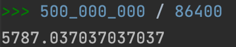

# Ivan Zakharov - Twitter architecture design

## 1. Обзор темы

### 1.1 Twitter

Твиттер — это социальная сеть для публичного обмена сообщениями, которая была запущена в 2006 году компанией "Twitter, Inc.". На данный момент Твиттер насчитывает более [5000 сотрудников](https://en.wikipedia.org/wiki/Twitter). 
Пользователи сервиса — люди любого возраста, имеющие доступ в сеть Интернет, однако преобладающей часть аудитории являются [мужчины 25-49 лет](https://www.businessofapps.com/data/twitter-statistics/). 
Использовать социальную сеть можно через веб-страницу, мобильное приложение или другие пользовательские клиент-приложения.
Бóльшая часть кодовой базы Твиттера [написана](https://www.infoq.com/articles/twitter-java-use/) на языках программирования "Java", "Ruby", "Scala", "JavaScript".
   
### 1.2 Целевая аудитория

При планировании курсовой работы было решено акцентировать внимание на ключевом функционале Твиттера — новостной ленте. 
Будем использовать следующие целевые значения:

- 300 миллионов пользователей сети;
- 500 миллионов твиттов в день;
- Географическое расположение пользователей: Северная Америка, Южная Америка, Европа.

## 2. Расчет нагрузки

### 2.1 Отправка / чтение твиттов

Каждый день новостная лента должна выдерживать большое количество запросов на чтение и запись. Исходя из запланированной нагрузки - 500 миллионов твиттов в день, допустим, что отношение запросов на чтение к запросам на запись = 10 / 1.
Таким образом, среднее значение **WriteRPS** = 500 миллионов / день ≈ 5800, **ReadRPS** = WriteRPS * 10 = 58000.

### 2.2 Пиковая нагрузка

География нашего сервиса позволяет сделать вывод, что пользователи расположены от -11 UTC timezone до +2 UTC timezone. Пользователи находятся в диапазоне 13 часов, таким образом, пиковая нагрузка относительно географии сервиса относительно равномерно распределена (исходя из предположения, что 16-ти часовая активность пользователей -11UTC будет компенсироваться активностью пользователей +1 UTC).
Пиковая нагрузка на Твиттер приходится на 13-тый час дня, количество твиттов за этот час [составляет](https://smallbusiness.chron.com/peak-times-twitter-activity-62864.html) 5.44% от дневного количества твиттов. Следовательно, пиковая нагрузка составляет 500 миллионов / день * 0.0544 / 3600 с ≈ 7 555 WriteRPS = 75 550 ReadRPS.
На пиковую нагрузку так же влияют [дни недели](https://neilpatel.com/blog/the-science-of-twitter-timing/), праздничные дни, [растущая аудитория сервиса](https://blog.hootsuite.com/twitter-statistics/#:~:text=Twitter's%20user%20base%20is%20predicted%20to%20grow%202.4%25%20in%202021&text=In%20October%2C%20they%20revised%20their,by%202.0%25%20growth%20in%202022.), мировые события и т.д.

Допустим, что максимальная нагрузка на сервис будет составлять троекратную среднюю нагрузку, следовательно, она будет равна WriteRPS * 3 = 17400, ReadRPS = 174 000.

## 2.3 Хранилище данных

### 2.3.1 Текстовое хранилище данных

Рассчитаем необходимое количество памяти для хранения всех твиттов пользователей в течении следующих 10 лет.
Максимальная длина твитта составляет 280 знаков, однако средняя длина твитта составляет ≈ [33 знака](https://techcrunch.com/2018/10/30/twitters-doubling-of-character-count-from-140-to-280-had-little-impact-on-length-of-tweets/#:~:text=Now%20that%20the%20limit%20is,limit%2C%20now%20it's%201%25.).
Примем во внимание, что каждый твитт имеет мета-информацию, которая занимает ≈ 60 байт.
Таким образом, **размер хранилища** будет равен (500 миллионов / день) * (3650 дней) * (33 + 60 байт) = 169725000000000 байт ≈ 170 Терабайт.

**Средний размер хранилища пользователя за 10 лет** будет составлять 170Тб / 300 миллионов ≈ 566 КБайт.
**Количество сохраняемых данных в день** 170Тб / 3650 дней ≈ 46.5 ГБайт.

### 2.3.2 Хранение изображений

В ходе собственного исследования я использовал выборку в 500 постов своей ленты в Твиттере. К 60 постам из выборки были добавлены фотографии.
Таким образом, в среднем к каждому 8 посту в Твиттере добавляется картинка, следовательно, количество постов, содержащих картинку = 0.125 * 500 миллионов / день = 62 500 000 картинок / день.
Максимальный размер картинки, которую пользователь [может загрузить](https://influencermarketinghub.com/twitter-image-size/#:~:text=The%20ideal%20image%20size%20and,re%20posting%20via%20their%20website.) в социальную сеть - 15 Мб при использовании вебсайта и 5 Мб при использовании мобильного приложения. Допустим, что средний размер фотографии в постах твиттера = 1Мб.
**Объем файлового хранилища** за 10 лет будет составлять (62.5 миллионов / день) * (3650 дней) * (1Мб) = 228125000000 Мб = 228.125 Петабайт.
Вероятно, что экономически более целесообразно создать собственный сервис для хранения изображений, аналогичный по принципу работы S3.

Количество сохраняемых данных в файловое хранилище в день 228.125 Пб / 3650 дней = 62.5 Терабайт.

## 3. Логическая схема

Поскольку частота запросов на чтение твиттов ленты крайне высока, необходимо реализовать систему, которая не будет сильно нагружаться при обычных запросах на чтение.
Мы бы могли хранить целиком всю информацию в кластерах in-memory базы данных, но следует понимать, что выигрывая по времени обращения к данным, мы проигрываем по экономическим показателем (покупка оперативной памяти, под хранение текста в нашем сервисе на ближайшие 10 лет обойдется в ≈93 миллиона рублей) и сложности разработки, даже учитывая, что персистентность данных будет соблюдаться. А так же полностью полагаться на один инструмент — может быть опрометчиво.
Поэтому для хранения копии данных мы будем использовать реляционную СУБД.
Предполагаемая схема данных в БД:

Перейдем к in-memory хранилищу. Для хранения данных мы можем использовать следующие пары ключей-значений:

UID - это уникальный идентификатор пользователя, TID - твитта, "-Tweets", "-Followers" и "-Tweet" - строки, обозначающие тип хранимых данных. Значения в квадратных скобках — идентификаторы твиттов и пользователей из дисковой базы данных. Значения ключей будут представлять собой список — структуру данных, имплементированную во многих in-memory хранилищах и строковый тип данных.

Чтобы показать ленту новостей определенного пользователя, мы обращаемся к UID-Tweets, получаем список всех ID твиттов пользователя, затем получаем по ключу TID-Tweet тексты твиттов.
Заведем еще две "кэш" сущности, которые будут уникальны для каждого пользователя: User Timeline и Home Timeline. Их использование рассмотрим на примере:

Представим, что пользователь создал новый твит. Мы должны сохранить его твит в базу данных, а так же добавить в "кэш"-сущность User Timeline идентификатор твитта.
После чего, подписанные на нас пользователи 1, 2 и 3 - получают данный твит в свою Home Timeline.

Аналогичным образом, пользователь получает все твитты от тех пользователей, на которых он подписан. А для того, чтобы отобразить их клиенту, нам достаточно проитерироваться по Home Timeline, и, возможно, отфильтровать данные.

Но что делать, если у пользователя миллионы подписчиков? Обновлять такое огромное количество листов в Redis - медленное решение.
Допустим, что популярный пользователь создал новый твитт. Аналогично обычному пользователю, мы сохраняем его новый твитт в базу данных и User Timeline. Теперь, этот твитт должен отобразить у подписчиков популярного пользователя при загрузке ленты новостей.
Для этого перед тем как отдать пользователю все новые посты, мы просмотрим на список популярных пользователей, на которых подписан данный пользователь. После чего, возьмем из User Timeline звезд те посты, которые нужны для отображения ленты, после чего добавим их в пользовательский Home Timeline.

## 4. Физическая схема

### 4.1 Схема данных и технологии

Для хранения копии данных в дисковой базе данных будем использовать Postgres.
Для хранения данных в памяти будем использовать Redis или любое другое горизонтально-масштабируемое in-memory хранилище данных (Tarantool, Aerospike и т.д.).
 

   
### 4.2 Шардирование и репликация

В данном подходе шардирование не так важно, поскольку мы храним на дисках копии значений, так же хранящихся к in-memory хранилище. Однако, стоит учесть, что мы могли бы прибегнуть к иному варианту - сильно реплицировать дисковую базу данных, чтобы задержки на операции чтения были минимальными. Redis и Postgres поддерживают master-slave репликацию, что мы могли бы использовать при таком подходе.
Рассмотрим две стратегии шардирования данных:
 - Шардирование данных по UserID;
 - Шардирование данных по TweetID.

#### 4.2.1 Шардирование по UserID

При использовании этого подхода, возникают ряд проблем:
- Шарды, хранящие информацию популярных пользователей, будут сильно нагружены, что повысит задержки на получение информации для пользователей, чья информация так же хранится на этом шарде;
- Ряд пользователей может создавать гораздо большее кол-во информации, чем остальные. Если не балансировать шарды, содержание большое кол-во популярных пользователей, то место на этих шардах закончится, а задержки к ним будут гораздо выше обычных.

#### 4.2.2 Шардирование по TweetID
Данных подход решает проблемы неравномерной загруженности шардов, однако для получения твиттов одного пользователя, необходимо будет запросить информацию с разных шардов.

## 5. Выбор технологий

Для разработки серверной части сервиса мы будем использовать Go (Gin), для фронтенд разработки JS (React).
Для хранилищ данных выберем Redis и Postgres.
В качестве фронтенд сервера выберем Nginx.

## 6. Схема проекта
   

**User** - клиент, обращающийся к нашему сервису. Чаще всего мобильное приложение или браузер.

**Frontend** - фронтенд-сервер, выполняющий роль отдачи статики и балансировщика нагрузки.

**Tweet Writer** - сервис, сохраняющий новые твитты пользователей в хранилище.

**In-memory Updater** - компонент, выполняющий логику кэширования новых твиттов пользователей (обновление Timeline).

**Feed Service** - сервис, отдающий пользователю посты его ленты.

**HTTP Push Websocket** - вебсокет, поддерживающий соединение с клиентом и оповещающий его о новых твиттах.
